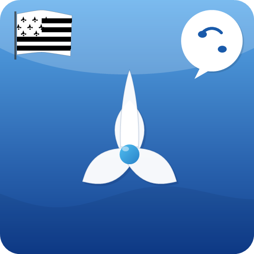

# KerPhone

**Softphone SIP pour Windows** développé par l'association [KerBzh](https://kerbzh.fr).



## Fonctionnalités

- Connexion à un serveur SIP (FreePBX, Asterisk, etc.)
- Appels entrants et sortants
- Clavier numérique intégré
- Mise en attente / Muet / Réglage du volume
- Historique des 10 derniers appels (sauvegardé)
- Mémorisation des identifiants de connexion
- Interface moderne sombre en français
- Application portable (un seul fichier .exe)

## Prérequis

- Windows 10/11 64 bits
- Aucune installation requise (application autonome)

## Utilisation

1. Télécharger `KerPhone.exe` depuis les [Releases](../../releases)
2. Lancer l'application
3. Renseigner les informations de connexion SIP (serveur, port, identifiant, mot de passe)
4. Appuyer sur **Connexion** ou la touche **Entrée**
5. Composer un numéro et appuyer sur **Appeler**

## Compilation depuis les sources

### Prérequis de compilation

- [.NET 8 SDK](https://dotnet.microsoft.com/download/dotnet/8.0)
- Visual Studio 2022 avec charge de travail C++ (pour compiler `pjsip_wrapper.dll`)

### Compiler

```powershell
# Compiler le wrapper natif PJSIP (nécessite VS 2022 C++)
.\build_wrapper.bat

# Publier l'application portable
dotnet publish src/SoftPhone/SoftPhone.csproj -c Release -r win-x64 --self-contained -o publish_single
```

Le fichier `KerPhone.exe` sera généré dans le dossier `publish_single/`.

## Architecture technique

- **C# / WPF / .NET 8** — Interface graphique MVVM
- **PJSIP / PJSUA2** — Moteur SIP natif (C)
- **P/Invoke** — Interopérabilité C# ↔ C via `pjsip_wrapper.dll`
- **CommunityToolkit.Mvvm** — Framework MVVM
- **NAudio** — Gestion audio

## Structure du projet

```
KerPhone/
├── src/SoftPhone/
│   ├── Assets/              # Logo, icônes
│   ├── Converters/          # Convertisseurs XAML
│   ├── Interop/             # P/Invoke PJSIP
│   ├── Services/            # SipService, SettingsService
│   ├── Themes/              # Thème sombre (Theme.xaml)
│   ├── ViewModels/          # MainViewModel (MVVM)
│   ├── MainWindow.xaml      # Interface principale
│   ├── CreditsWindow.xaml   # Fenêtre À propos
│   └── App.xaml             # Point d'entrée
├── native/
│   └── pjsip_wrapper.c      # Wrapper C autour de PJSUA
├── setup.ps1                # Script d'installation automatique
└── build_wrapper.bat         # Compilation du wrapper natif
```

## Crédits

Application développée par l'association **[KerBzh](https://kerbzh.fr)**

Chef de projet : **Pierre LEGENDRE**

📧 [contact@kerbzh.fr](mailto:contact@kerbzh.fr)

## Licence

© 2026 Association KerBzh — Tous droits réservés
